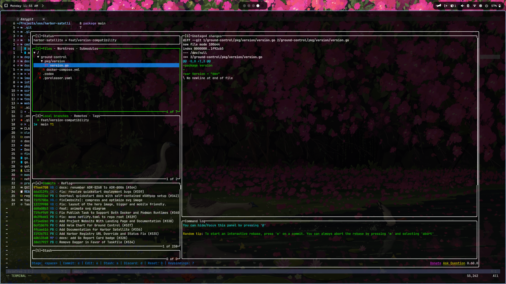
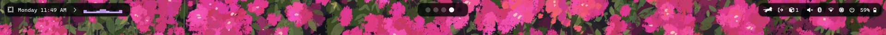
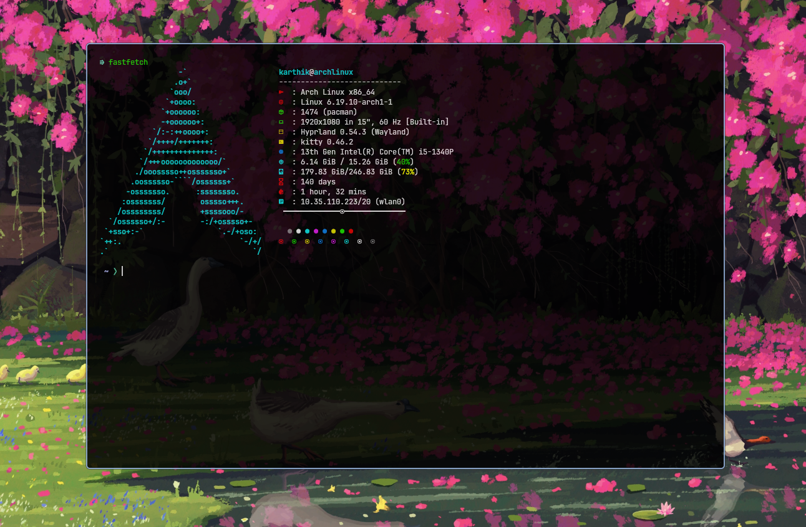

# mydots

My dotfiles. Hyprland, Ghostty/Kitty, Neovim, Zsh, Waybar, and a bunch of other stuff I like.

Every config lives in its own folder, so you can just grab the one you want instead of stowing the whole repo.

## Skills

Install a skill with `npx skills`

```bash
npx skills add https://github.com/kaizakin/mydots/tree/main/skills/<skill-name>
```

Or you can download the skill directory and copy it into your Claude skills folder:

```bash
cp -r codebase-onboarding ~/.claude/skills/
```

You can use a skill by tagging explicitly with `/skill`, e.g. `/codebase-onboarding`.

| Skill                                             | Description                                                                                                                                            |
| ------------------------------------------------- | ------------------------------------------------------------------------------------------------------------------------------------------------------ |
| [ai-slop-humanizer](skills/ai-slop-humanizer)     | Turns a AI generated jargony slop into a human written conversational tone for easy understanding (not-perfect-yet)                                    |
| [codebase-onboarding](skills/codebase-onboarding) | Creates a ONBOARDING.md file containing easily digestable information about the project for beginner contributors                                      |
| [deep-explainer](skills/deep-explainer)           | Explain the user's question without using much jargons & without being blunt. Use the current directory's codebase context well to answer the question |

## Setup

Install stow:

```bash
sudo pacman -S stow   # arch
sudo apt install stow # debian/ubuntu
```

Clone it and stow what you need:

```bash
git clone https://github.com/kaizakin/mydots
cd mydots
stow nvim
```

Only want one thing? Just `stow` that one folder, or skip stow entirely and copy it wherever it needs to go.

## Neovim



## Waybar



## Fastfetch


