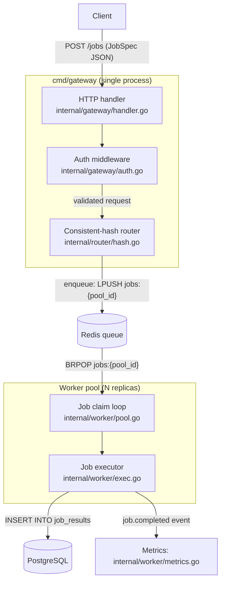
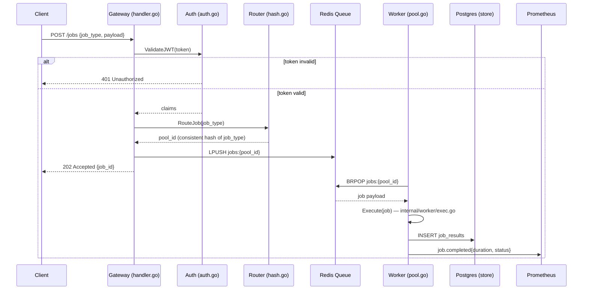
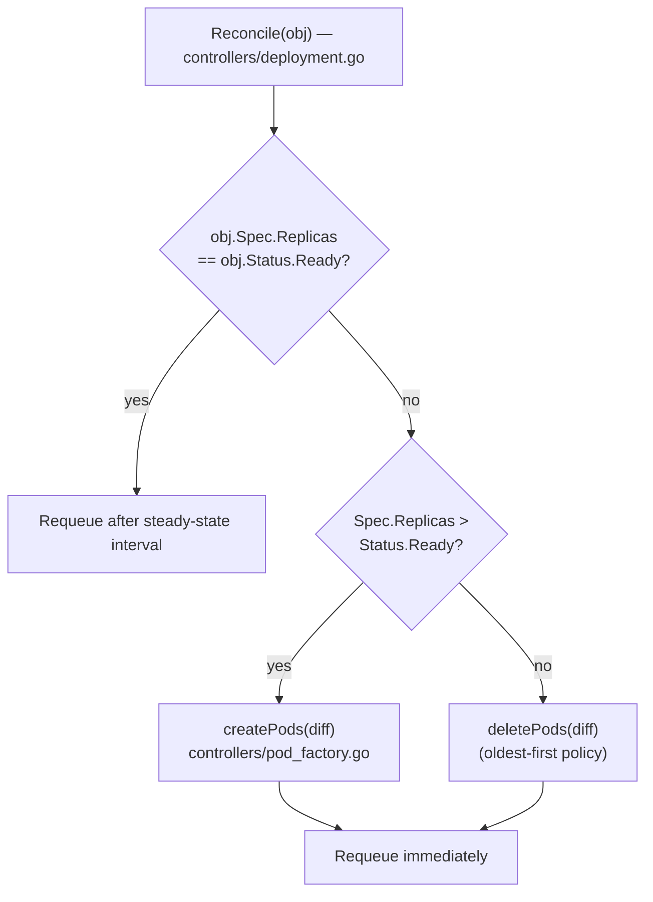
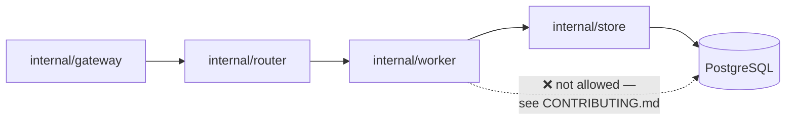

# Building Precise Architecture and Flow Diagrams

Generic diagrams are worse than no diagram at all — a box labeled "Backend" pointing to a box labeled "Database" tells a contributor nothing they didn't already assume. Every diagram in ONBOARDING.md must be traceable back to specific things you actually found in the code: real file paths, real function names, real message/data structures. If you can't point to the exact place in the repo a diagram node represents, you haven't done enough research yet to draw it — go back and trace the code path first.

Use Mermaid syntax (GitHub renders it natively in Markdown, which is why it's the right choice for a file that lives in the repo itself).

## Do this research before drawing anything

For each diagram you plan to include:

1. Identify the real entry point for the flow you're diagramming (an HTTP handler function, a CLI command's `Run` function, a message consumer's callback — whatever it actually is in this codebase).
2. Actually read the code path from that entry point outward, noting each meaningful hop: which function calls which, which module boundary gets crossed, what data structure or message gets passed at each step, and where control returns versus where it forks (goroutine spawned, async callback registered, event published).
3. Note any place where the flow branches based on a real condition in the code (e.g. cache hit vs. miss, auth success vs. failure, sync vs. async mode) — these branch points are usually the most valuable thing to show in a flow diagram, since they're what a newcomer would otherwise have to reverse-engineer by reading code themselves.
4. Only after you've done this tracing should you translate it into a diagram. The diagram is a distillation of what you found, not a guess at what a typical system like this "probably" looks like.

## Two kinds of diagrams you'll typically need

### 1. High-level architecture diagram

Shows the major components/services/modules and the real relationships between them — not a generic layered diagram, but the actual shape of this system. Label edges with what's actually being sent (e.g. "gRPC: SubmitJob(JobSpec)", not just an unlabeled arrow). Use subgraphs to group things that are genuinely deployed or reasoned about together (e.g. "runs in the same process" vs. "separate service").

Notice every node cites a real file, and every edge describes the actual data or call, not a bare line.

### 2. Sequence / flow diagram for a specific real operation

Pick the operations that matter most to a contributor — usually the project's central "unit of work" (a request, a build step, a sync cycle) — and show it as a sequence diagram if the flow is about interaction between distinct actors/services over time, or a flowchart with decision branches if it's about one code path making decisions.

Use `alt`/`else` blocks for real branches you found in the code (error paths, cache hits/misses, feature-flagged behavior) — these are usually the most instructive part of the diagram, since the happy path alone is often obvious from the README, and the branches are what actually confuses newcomers.

## When a flowchart (not sequence) is the better fit

For flows that are mostly about one component making a series of internal decisions (parsing, compiling, a state machine, a reconcile loop) rather than several actors talking to each other, use `flowchart` with decision diamonds:

## Module dependency diagram (optional, use when the module graph itself is non-obvious)

If the project has a layering convention worth enforcing understanding of (e.g. "internal/store is the only package that talks to the database directly"), a small dependency diagram can make that boundary vivid in a way prose alone sometimes doesn't:

Use this pattern sparingly, and only when there's a real architectural rule to illustrate — not as a decorative restatement of the folder tree.

## Common mistakes to avoid

- **Placeholder nodes.** "Service A", "Component X", "Database" — every node should have a real name pulled from the code.
- **Unlabeled edges.** An arrow with no label forces the reader to guess what's flowing. Label it with the real call, message type, or event name.
- **Cramming everything into one diagram.** If a system has a read path and a write path, or a sync mode and an async mode, diagram them separately. A diagram trying to show too much at once becomes as unreadable as the wall-of-text it's meant to replace.
- **Diagramming the folder structure instead of the runtime behavior.** A directory tree already covers "where files live" — diagrams should earn their place by showing _behavior over time_ or _runtime relationships_, not duplicate the tree in box form.
- **Guessing.** If you're not sure whether a call is synchronous or fire-and-forget, whether a queue is durable, or which service owns a boundary — go check the code. A diagram that's confidently wrong is worse for a new contributor than no diagram, since it actively misleads.
